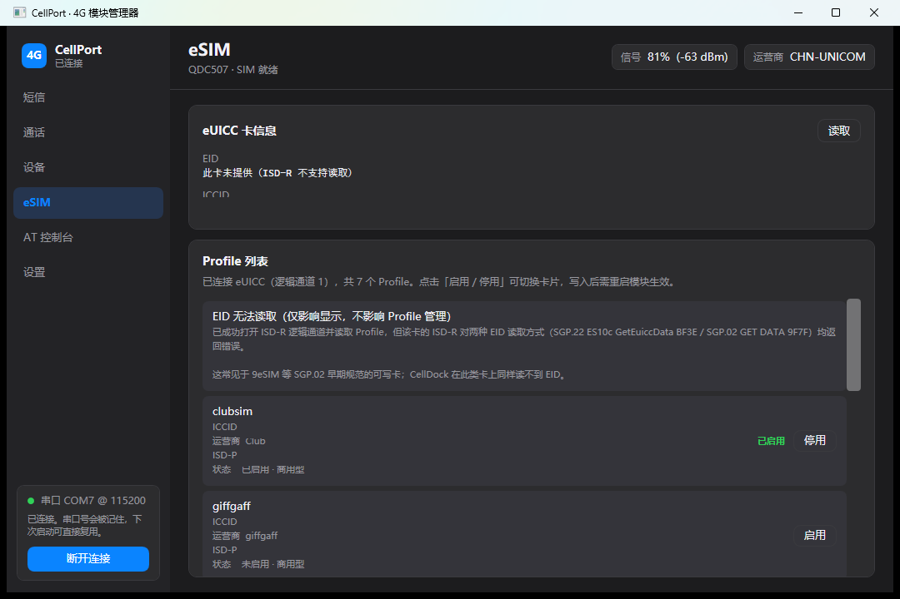

# CellPort

**A Windows-native manager for DJI 1st-gen 4G modules (Quectel EG25-G) — SMS · Calls · Device info · eSIM / eUICC profile switching · AT console.**


CellPort 是一款 **Windows 原生**（不依赖 WSL）的大疆一代 4G 模块管理器，功能对标 macOS 上的 CellDock：
短信收发、语音通话、设备状态、**eSIM / eUICC Profile 管理（含切卡）** 与 AT 控制台。

> 硬件为大疆 4G 模块一代（实为 Quectel EG25-G / MDM9607 内核），
> 理论上兼容所有 EG25-G / EC25 系列模组。

**📥 免构建下载**：前往 [Releases](https://github.com/xmgzxmgz/CellPort/releases/latest) 下载 `CellPort-v1.0.0-win-x64.zip`，
解压运行 `CellPort.exe`（需 [.NET 9 Desktop Runtime (x64)](https://dotnet.microsoft.com/download/dotnet/9.0)）。



## 功能特性

- **短信**：接收（`+CMTI` / `+CMT` 主动上报）、发送（PDU 模式）、长短信（UDH 8/16-bit）自动拼接、
  UCS2 中文、GSM 7-bit 打包、会话式双栏界面
- **语音通话**：拨号、接听、挂断、DTMF、静音、通话记录
- **设备状态**：型号、固件、运营商、信号（dBm/%）、网络制式、频段、SIM 状态、
  IMEI / ICCID / IMSI / 本机号码、注册状态、数据附着、USB 接口列表
- **eSIM / eUICC**（本项目的核心）：
  - 逻辑通道读取：EID（双路径）+ Profile 列表（ICCID / 运营商 / ISD-P AID / 状态 / 类别）
  - **Profile 启用 / 停用切卡**（真机验证通过），写入后引导重启模块并自动重连
- **AT 控制台**：任意指令执行、历史翻阅、快捷指令
- **连接策略**：串口自动探测 + 端口缓存 + 蓝牙虚拟口剔除，冷启动 ~600ms、热启动 ~60ms
- 深 / 浅 / 跟随系统主题；短信转发到 Bark / 飞书 / 钉钉

## 硬件背景（已实测确认）

| 项目 | 值 |
| --- | --- |
| 模组型号 | Baiwang **QDC507** |
| 模组内核 | Quectel **EG25-G**（Qualcomm MDM9607，Linux 3.18.44 ARMv7） |
| USB VID:PID（大疆原厂定制） | `2ca3:4006` |
| USB VID:PID（移远标准） | `2c7c:0125` |
| 本机实测固件 | `QDC507GLEFM21` |

## 关键结论：这个模块读不了 eUICC？——用对通道就行

开发初期曾得出「QDC507 固件的 `AT+CSIM` 透传有 ~8 字节 APDU 长度上限，
因此物理上无法进入 ISD-R」的结论 —— **这个结论是错的**。CSIM 的长度限制属实：

| APDU | 长度 | 结果 |
|---|---|---|
| `00A40000023F00`（SELECT MF） | 7 字节 / 14 字符 | `9000` 成功 |
| 同上补 1 字节 | 8 字节 / 16 字符 | `612E`（指令已执行） |
| 同上补 2 字节 | 9 字节 / 18 字符 | **无任何响应** |
| `00A4040000` + 16 字节 AID | 21 字节 / 42 字符 | **无任何响应** |

但 SELECT ISD-R 本来就不该走 CSIM —— CellDock 内嵌的 [lpac](https://github.com/estkme-group/lpac)
走的是 **3GPP TS 27.007 逻辑通道指令**，完全绕开这条限制：

1. `AT+CCHO="<ISD-R AID>"` —— **模块固件内部完成 ISD-R 选择**，返回 `+CCHO: <通道号>`；
2. `AT+CGLA=<ch>,<len>,"<hex>"` —— 在该通道上透传 APDU，与 eUICC 的 ES10x 交互；
3. `AT+CCHC=<ch>` —— 关闭通道。

QDC507 固件（`QDC507GLEFM21_01.001.02.001`）对这三条指令**全部支持**。
本项目据此实现了完整的 ES10c 客户端：

- **STORE DATA 分帧**（与 lpac `es10x_transmit_iter` 对齐）：CLA=`0x80|ch`、INS=`0xE2`、
  P1=`0x11`（中间块）/ `0x91`（末块）、P2=块序号，单块上限 120 字节；
  `61xx` 时以 `80 C0 00 00 <sw2>`（GET RESPONSE）循环取数。
- **GetProfilesInfo**（`BF2D 00`）：响应按 `BF2D → A0 → E3` 逐层解析
  （`5A` ICCID / `4F` ISD-P AID / `9F70` 状态 / `90` 昵称 / `91` 运营商 / `92` Profile 名 / `95` 类别）。
- **GetEid**：先 SGP.22 `BF3E 02 5C 01 5A`，失败回退 SGP.02 `GET DATA (0x80|ch) CA 9F 7F 00`。

实测（9eSIM 可写 eUICC 实体卡）：**7 个 Profile 全部可读**
（clubsim / giffgaff / Vodafone DE / Top_Connect / Lifecell / ChinaTelecom Macau / WEBBING，含 ICCID 与状态）。

## eSIM 切卡：ES10c EnableProfile / DisableProfile

切换走 `BF31`（启用）/ `BF32`（停用），请求编码与 lpac `es10c.c` 逐字节一致：

```
BF31 <len> A0 <len> 4F <len> <ISD-P AID> 81 01 00     ← refreshFlag = FALSE
响应： BF31 <len> 80 01 <code>                          ← 0 = 成功
```

真机实测（9eSIM）：

- 启用未启用的 Profile → `Code=0 成功`，eUICC **自动停用**当前已启用的 Profile（单激活卡）；
- 恢复启用原 Profile → `Code=0 成功`；
- 对「已停用」的 Profile 再发停用 → `Code=2`（invalidProfile，该卡的正常语义）。

**生效条件**：写入 eUICC 后 modem 的 SIM 会话不会自动刷新 —— 需要 `AT+CFUN=1,1` 重启模块
（约 40 秒）。程序会在写入成功后询问，确认后自动重启、等待端口恢复、重连并重新读取 Profile 列表。

## 连接策略

QDC507 向系统暴露 6 个串口（COM4~COM9），其中 AT 口在 COM6/COM7 之间漂移，
COM8/COM9 是蓝牙虚拟口（`BTHENUM`，应剔除）。本项目的连接流水线：

| 场景 | 耗时 | 说明 |
|---|---|---|
| 冷启动（无缓存） | ~600ms | 两段式：已知端口先试 → 未命中才全量并行 |
| 热启动（端口缓存） | ~60ms | 上次成功端口持久化在 `%APPDATA%\CellPort\settings.json` |

失败排查日志写入 `%APPDATA%\CellPort\last-connect.log`（`[1/5]~[5/5]` 全过程）。

## 构建与运行

需求：Windows 10+、[.NET 9 SDK](https://dotnet.microsoft.com/download/dotnet/9.0)、
Quectel USB 驱动（插上模块 Windows 一般自带）。

```bash
git clone https://github.com/xmgzxmgz/CellPort.git
cd CellPort
dotnet build CellPort.sln -c Release
dotnet run --project src/CellPort.App
```

或直接 `dotnet publish src/CellPort.App -c Release -o dist` 后运行 `dist\CellPort.exe`。

> 提示：直接双击启动会触发自动连接；`CellPort.exe --page esim` 可直接打开指定页面
> （sms / calls / device / esim / console / settings）。

## 项目结构

```
CellPort/
├── CellPort.sln
├── src/
│   ├── CellPort.Core/          # 核心库（无 UI 依赖）
│   │   ├── At/                 #   AT 引擎、SMS PDU 编解码
│   │   ├── Transport/          #   串口通道、模块识别（USB VID/PID）
│   │   ├── Models/             #   设备状态 / Profile 模型
│   │   └── Services/           #   ModemManager / DeviceInfo / Sms / Call
│   │                           #   LogicalChannelEs10 (CCHO/CGLA + ES10c) / BerTlv
│   └── CellPort.App/           # WPF 界面（深浅主题、六页面）
├── tools/
│   ├── PortProbe/              # 串口枚举 + AT 探测（排障用）
│   ├── EsimProbe/              # eUICC 全链路验证（读取 + 切卡回环测试）
│   ├── DiagTool/               # 连接诊断
│   └── E2E/                    # 端到端真机测试
└── docs/                       # 截图（已脱敏）
```

## 已知限制

- **EID**：SGP.22 `BF3E` 与 SGP.02 `GET DATA 9F7F` 两条路径在 9eSIM 这类早期规范卡上
  均被 ISD-R 拒绝（`6A80` / `6D00`）—— 是卡片不提供，不是模块问题；
  CellDock 在此类卡上同样读不到。Profile 管理不受影响。
- **Profile 删除（`BF33`）与昵称修改（`BF29`）尚未实现**；需要时可用 EasyLPAC 等工具操作。
- 切卡后必须重启模块（或重新上电）新卡才生效 —— modem 侧限制，程序已做引导与自动重连。
- 数据网卡（MI_04，ECM）拨号由 Windows 处理，程序不介入。

## FAQ

**Q: 启动后左下角显示「未自动连接」？**
不是模块故障。程序会先复用上次成功端口（热启动 ~60ms），失败再全量探测；
查看 `%APPDATA%\CellPort\last-connect.log` 定位，或手动点「连接模块」。

**Q: EID 一栏显示「此卡未提供（ISD-R 不支持读取）」？**
EID 与 Profile 是两条独立读取路径；该提示仅表示 EID 不可读（常见于 SGP.02 早期卡），
Profile 列表与切卡功能不受影响。

**Q: 支持其他模块吗？**
任何基于 EG25-G / EC25 且固件支持 `AT+CCHO` / `AT+CGLA` 的设备理论上均可；
可用 AT 控制台执行 `AT+CCHO=?` 验证。

## 致谢

- [CellDock for Mac](https://github.com/celldock/celldock-for-mac) —— 本项目的功能蓝本与思路来源
- [lpac](https://github.com/estkme-group/lpac) —— eUICC 协议实现参考（ES10x / BER-TLV）

## License

[MIT](LICENSE)
